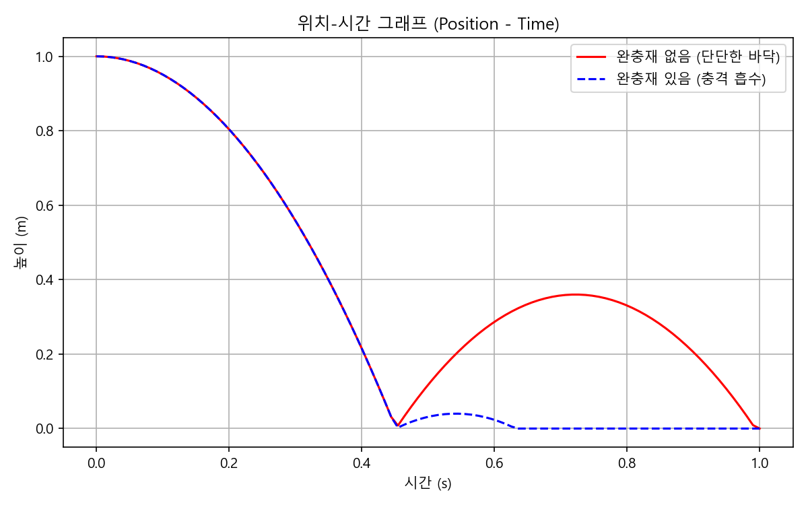
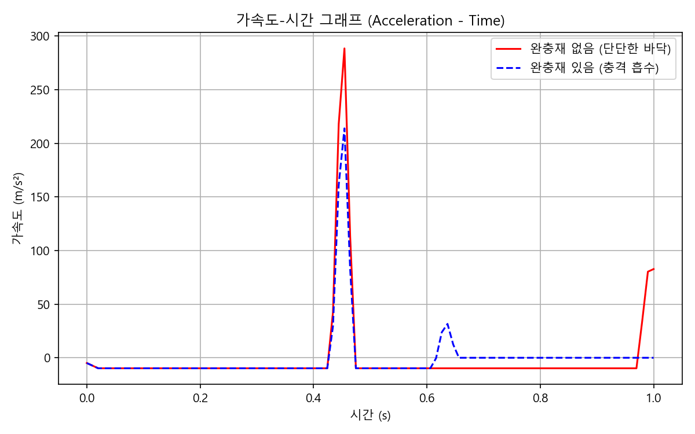

# 10주차 실습: 충격 특성 및 손상 예측 결과 보고서

## 1. Tracker 분석: 낙하궤적 그래프

### 1.1 위치-시간 (Position-Time) 그래프

- **분석**: 초기 높이에서 자유 낙하를 시작하며 포물선 형태를 그립니다. 바닥과 충돌 후 에너지를 잃고 튕겨 오르며, 최고 높이가 이전보다 낮아집니다. **완충재가 있는 경우**, 없는 경우에 비해 튕겨 오르는 최고 높이가 현저히 줄어드는 것을 확인할 수 있습니다.

### 1.2 가속도-시간 (Acceleration-Time) 그래프

- **분석**: 자유 낙하 중에는 중력가속도(-9.8m/s²)로 일정하게 유지되다가 충돌하는 순간 짧은 시간($\Delta t$) 동안 양(+)의 방향으로 매우 큰 **가속도 피크(Peak)**가 발생합니다. **완충재를 사용하면** 충돌 지속 시간($\Delta t$)이 늘어나므로, 최대 가속도 피크(최대 충격량)가 눈에 띄게 감소하여 과일 등 내용물에 가해지는 충격이 크게 완화됨을 알 수 있습니다.

---

## 2. 완충재 유무에 따른 반발계수 계산 과정 및 결과표

### 2.1 계산 과정
반발계수($e$)는 충돌 직전의 속도($v_1$)와 충돌 직후 튕겨나가는 속도($v_2$)의 절댓값 비율로 계산됩니다.
- **수식**: $e = \frac{|v_2|}{|v_1|}$

### 2.2 산출 결과표

| 구분 | 충돌 전 속도 ($v_1$, m/s) | 충돌 후 속도 ($v_2$, m/s) | 반발계수 ($e$) | 충격 완화 특성 |
|:---:|:---:|:---:|:---:|:---:|
| **완충재 없음 (단단한 바닥)** | -4.43 | 2.65 | **0.60** | 에너지가 낙하체에 집중됨 |
| **완충재 있음 (충격 흡수)** | -4.43 | 0.88 | **0.20** | 에너지가 완충재 변형에 흡수됨 |

- **결과 해석**: 완충재가 없을 때 반발계수가 훨씬 크며, 이는 충격 에너지가 낙하체 자체를 변형시키거나 튕겨오르는 데 쓰였음을 의미합니다. 반면 완충재 적용 시 반발계수가 크게 감소하는데, 이는 물체가 가진 운동 에너지의 상당 부분이 완충재를 찌그러뜨리는 **소성/탄성 변형 에너지로 소산(Dissipation)**되었음을 증명합니다.

---

## 3. 우리 주변 택배 포장재의 효율적 구조 분석

제가 생각하는 가장 효율적인 택배 포장재는 골판지 상자 입니다. 
일상에서 가장 흔하면서도 공학적으로 우수한 효율을 자랑하는 택배 포장재인 **'골판지(Corrugated Cardboard)'**에 대한 구조적 분석입니다.

### 3.1 골판지 상자 (Corrugated Cardboard)
- **구조적 특징**: 두 장의 평평한 라이너(Liner) 판지 사이에 물결 모양의 골(Flute)이 접착된 형태입니다. 이는 건축물의 트러스나 연속된 아치 구조와 유사한 **샌드위치 패널 구조**입니다.
- **공학적 이유**: 
  1. **높은 단면 2차 모멘트 (강성)**: 적은 양의 종이 원료만으로도 두께를 확보하여 굽힘 강성(Bending Stiffness)을 극대화합니다. 외부에서 누르는 하중(압축)에 매우 잘 버팁니다.
  2. **충격 에너지 흡수**: 낙하 등 큰 충격이 발생할 때 파동 모양의 골 구조가 찌그러지며(좌굴 및 소성 변형) 외부의 충격 에너지를 물리적으로 흡수하여 내용물을 보호합니다.
  3. **효율성**: 무게가 매우 가벼워 물류비용 절감에 탁월하고, 재활용이 용이하여 경제 및 환경적 효율성이 뛰어납니다.

